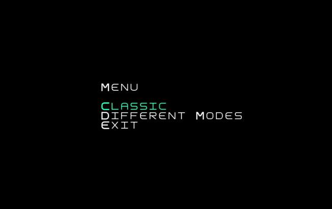
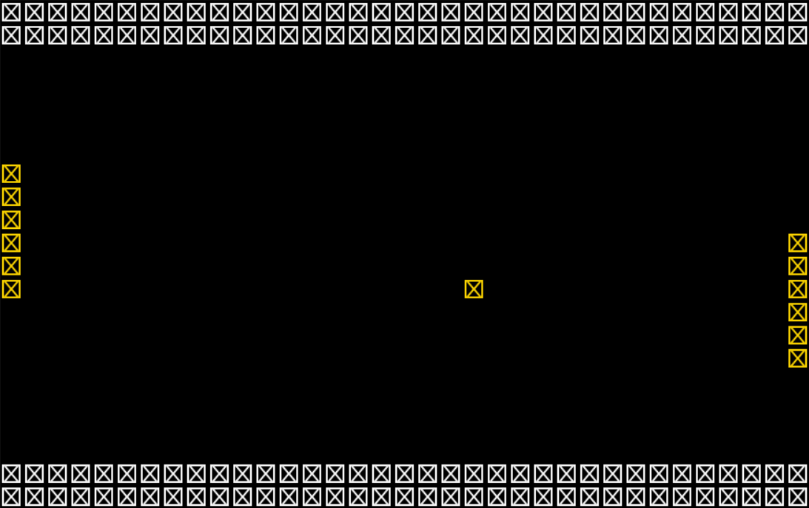
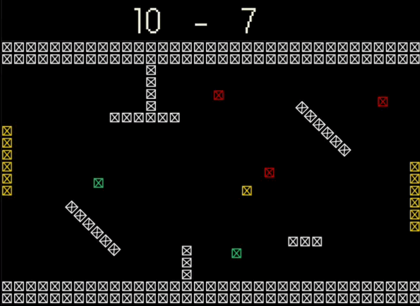
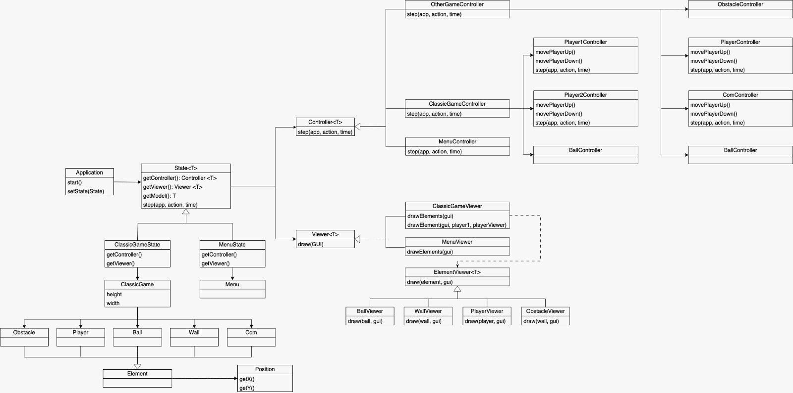
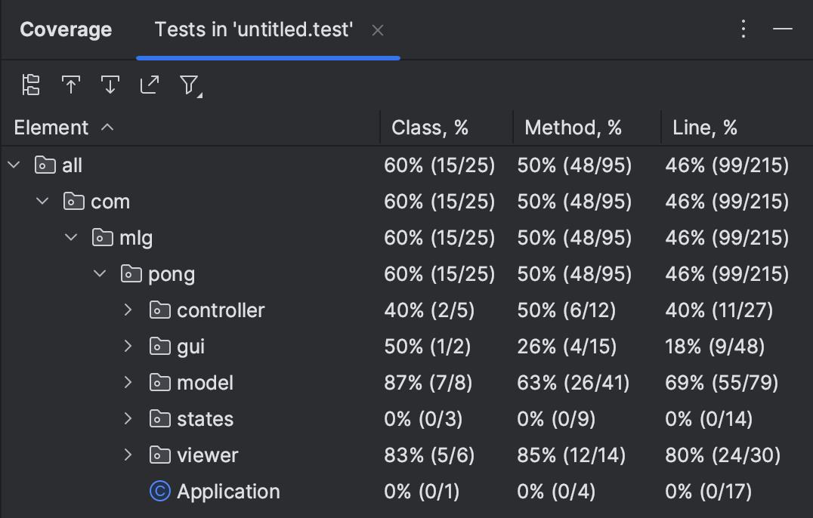

# LDTS - TURMA 10, GRUPO 9
# PONG-GAME

> Neste projeto procuramos recriar o emocionante mundo do Pong.
> Nesta nossa reinterpretação de um clássico procuramos explorar um lado mais inovador e desafiador do jogo, nunca perdendo o lado nostálgico deste.
>
> Assim apresentamos um modo clássico, onde procuramos oferecer a experiência de jogar o Pong original, e também vários modos diferentes, onde o jogador poderá escolher de que forma se quer desafiar, podendo optar, por exemplo, por enfrentar mais que um adversário, jogar num cenário com vários muros adicionais ou aventuar-se com power-ups e debuffs, múltiplas bolas e vários níveis de dificuldade.
>
> Um jogador poderá ainda jodar sozinho ou com um amigo a partir do mesmo computador, tentando pontuar o maior número de vezes para ganhar.
>
>
> Este projeto foi desencvolvido por Gabriel Braga (up202207784@up.pt), Luana Lima (up202206845@up.pt) e Miguel Cabral (up202204496@up.pt) para a UC de LDTS no ano 2023/24.

-----
### FUNCIONALIDADES

Até ao momento criamos funcionalidades que permitem apresentar o menu principal, o modo clássico com a bola e dois jogadores, sendo que apenas o jogador da esquerda se move de momento, com input do utilizador.

- Exemplos:

Além disso iremos procurar polir e aprimorar o código já implementado, para conseguirmos ter o modo clássico perfeitamente operacional e trataremos de desenvolver novas funcionalidades para elevar a qualidade e a experiência de jogar esta versão do Pong.

- Exemplo do que gostariamos de implementar:

-----
### DESIGN

Modelo UML:

Neste projeto utilizamos os seguintes modelos:

- *MVC Pattern*
- *State Pattern*
- *Adapter Pattern*

-----
### TESTES

- *Coverage Report*

