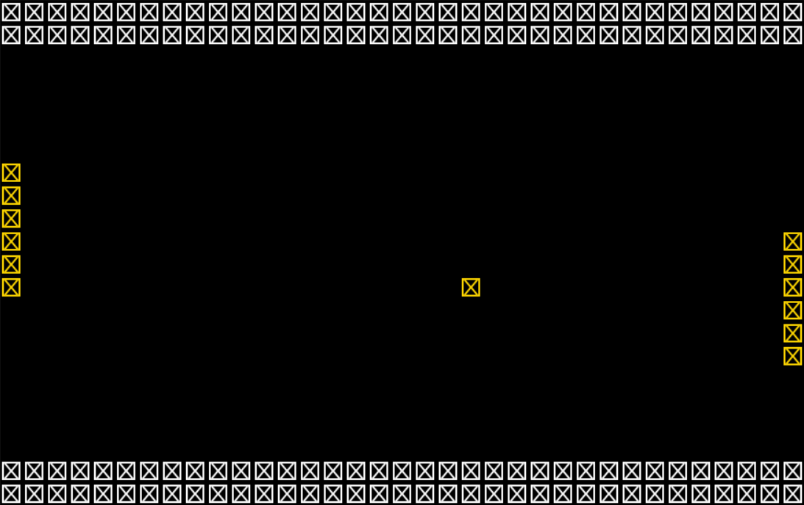

## LDTS - TURMA 10, GRUPO 9 
## PONG-GAME

> Neste projeto procuramos recriar o emocionante mundo do Pong.
> Nesta nossa reinterpretação de um clássico procuramos explorar um lado mais inovador e desafiador do jogo, nunca perdendo o lado nostálgico deste.
> 
> Assim apresentamos um modo clássico, onde procuramos oferecer a experiência de jogar o Pong original, e também vários modos diferentes, onde o jogador poderá escolher de que forma se quer desafiar, podendo optar, por exemplo, por enfrentar mais que um adversário, jogar num cenário com vários muros adicionais ou aventuar-se com power-ups e debuffs, múltiplas bolas e vários níveis de dificuldade.
> 
> Um jogador poderá ainda jodar sozinho ou com um amigo a partir do mesmo computador, tentando pontuar o maior número de vezes para ganhar. 
> 
> 
> Este projeto foi desencvolvido por Gabriel Braga (up202207784@up.pt), Luana Lima (up202206845@up.pt) e Miguel Cabral (up202204496@up.pt) para a UC de LDTS no ano 2023/24.

###
### FUNCIONALIDADES IMPLEMENTADAS

> Exemplos de funcionalidades que implementamos até ao momento da primeira entrega:

- **Menu** - Possiblita a escolha do modo de jogo ("Clássico" ou "Modos Diferentes") ou da saída do mesmo ("End of Game")
- **Movimentação do Player** - Muda a posição do jogador da esquerda na vertical conforme input do utilizador
- **Bola e Segundo Player** - Apesar de ainda não se movimentarem, são criados o jogador adversário e a bola, elementos essenciais do jogo

###
### FUNCIONALIDADES PLANEADAS

- **Menu Modos Diferentes** - Para o utilizador poder escolher quais os modos que quer ativados
- **Power-ups** - Elementos que se movimentarão e que o jogador pode apanhar para o ajudarem durante o jogo
- **Debuffes** - Elementos que se movimentam e que se o jogador os apanhar, o prejudicarão durante algum tempo no jogo
- **Segundo Jogador** - Permitir que mais um jogador jogue ao mesmo tempo
- **Vários Adversários** - Muda o formato da área de jogo e incere vários jogadores
- **Som** -  Permite que certas ações tenham um som característico
- **Marcação de pontos** - Quando a bola entr numa parede, o jogador contrário ganha um ponto, o que depois define quem ganha a partida

###
### DESIGN

> This section should be organized in different subsections, each describing a different design problem that you had to solve during the project. Each subsection should be organized in four different parts:

- **Problem in Context.** The description of the design context and the concrete problem that motivated the instantiation of the pattern. Someone else other than the original developer should be able to read and understand all the motivations for the decisions made. When refering to the implementation before the pattern was applied, don’t forget to [link to the relevant lines of code](https://help.github.com/en/articles/creating-a-permanent-link-to-a-code-snippet) in the appropriate version.
- **The Pattern.** Identify the design pattern to be applied, why it was selected and how it is a good fit considering the existing design context and the problem at hand.
- **Implementation.** Show how the pattern roles, operations and associations were mapped to the concrete design classes. Illustrate it with a UML class diagram, and refer to the corresponding source code with links to the relevant lines (these should be [relative links](https://help.github.com/en/articles/about-readmes#relative-links-and-image-paths-in-readme-files). When doing this, always point to the latest version of the code.
- **Consequences.** Benefits and liabilities of the design after the pattern instantiation, eventually comparing these consequences with those of alternative solutions.

**Example of one of such subsections**:

------

#### THE JUMP ACTION OF THE KANGAROOBOY SHOULD BEHAVE DIFFERENTLY DEPENDING ON ITS STATE

**Problem in Context**

There was a lot of scattered conditional logic when deciding how the KangarooBoy should behave when jumping, as the jumps should be different depending on the items that came to his possession during the game (an helix will alow him to fly, driking a potion will allow him to jump double the height, etc.). This is a violation of the **Single Responsability Principle**. We could concentrate all the conditional logic in the same method to circumscribe the issue to that one method but the **Single Responsability Principle** would still be violated.

**The Pattern**

We have applied the **State** pattern. This pattern allows you to represent different states with different subclasses. We can switch to a different state of the application by switching to another implementation (i.e., another subclass). This pattern allowed to address the identified problems because […].

**Implementation**

The following figure shows how the pattern’s roles were mapped to the application classes.

These classes can be found in the following files:

- [Character](https://web.fe.up.pt/~arestivo/page/courses/2021/lpoo/template/src/main/java/Character.java)
- [JumpAbilityState](https://web.fe.up.pt/~arestivo/page/courses/2021/lpoo/template/src/main/java/JumpAbilityState.java)
- [DoubleJumpState](https://web.fe.up.pt/~arestivo/page/courses/2021/lpoo/template/src/main/java/DoubleJumpState.java)
- [HelicopterState](https://web.fe.up.pt/~arestivo/page/courses/2021/lpoo/template/src/main/java/HelicopterState.java)
- [IncreasedGravityState](https://web.fe.up.pt/~arestivo/page/courses/2021/lpoo/template/src/main/java/IncreasedGravityState.java)

**Consequences**

The use of the State Pattern in the current design allows the following benefits:

- The several states that represent the character’s hability to jump become explicit in the code, instead of relying on a series of flags.
- We don’t need to have a long set of conditional if or switch statements associated with the various states; instead, polimorphism is used to activate the right behavior.
- There are now more classes and instances to manage, but still in a reasonable number.

#### KNOWN CODE SMELLS

> This section should describe 3 to 5 different code smells that you have identified in your current implementation.

###
### TESTING

- Screenshot of coverage report.
- Link to mutation testing report.

###
### SELF-EVALUATION

> Nesta primeira parte, o Gabriel fez os testes para as funcionalidades já criadas, a Luana tratou da documentação e o Miguel implementou a primeira versão do código.
> - Gabriel: %
> - Luana: %
> - Miguel: %