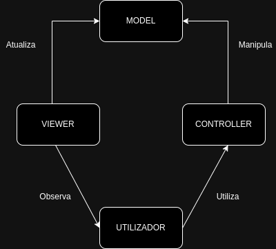

## LDTS - TURMA 10, GRUPO 9 
## PONG-GAME

> Neste projeto procuramos recriar o emocionante mundo do Pong.
> Nesta nossa reinterpretação de um clássico procuramos explorar um lado mais inovador e desafiador do jogo, nunca perdendo o lado nostálgico deste.
> 
> Assim apresentamos um modo clássico, onde procuramos oferecer a experiência de jogar o Pong original, e também vários modos diferentes, onde o jogador poderá escolher de que forma se quer desafiar, podendo optar, por exemplo, por enfrentar mais que um adversário, jogar num cenário com vários muros adicionais ou aventuar-se com power-ups e debuffs, múltiplas bolas e vários níveis de dificuldade.
> 
> Um jogador poderá ainda jodar sozinho ou com um amigo a partir do mesmo computador, tentando pontuar o maior número de vezes para ganhar. 
> 
> 
> Este projeto foi desencvolvido por Gabriel Braga (up202207784@up.pt), Luana Lima (up202206845@up.pt) e Miguel Cabral (up202204496@up.pt) para a UC de LDTS no ano 2023/24.

-----
### FUNCIONALIDADES IMPLEMENTADAS

> Exemplos de funcionalidades que implementamos até ao momento da primeira entrega:

- **Menu** - Possiblita a escolha do modo de jogo ("Classic" ou "Different Modes") ou da saída do mesmo ("Exit")
- **Movimentação do Player** - Muda a posição do jogador da esquerda na vertical conforme input do utilizador
- **Bola e Segundo Player** - Apesar de ainda não se movimentarem, são criados o jogador adversário e a bola, elementos essenciais do jogo

-----
### FUNCIONALIDADES PLANEADAS

- **Menu Modos Diferentes** - Para o utilizador poder escolher quais os modos que quer ativados
- **Power-ups** - Elementos que se movimentarão e que o jogador pode apanhar para o ajudarem durante o jogo
- **Debuffes** - Elementos que se movimentarão e que se o jogador os apanhar, o prejudicarão durante algum tempo no jogo
- **Segundo Jogador** - Permitir que mais um jogador jogue ao mesmo tempo
- **Vários Adversários** - Muda o formato da área de jogo e incere vários jogadores
- **Som** -  Permite que certas ações tenham um som característico
- **Marcação de Pontos** - Quando a bola entr numa parede, o jogador contrário ganha um ponto, o que depois define quem ganha a partida

-----
### DESIGN

> Problemas com o design do código que enfrentamos até ao momento da primeira entrega:

###
- #### ESTRUTURA DO CÓDIGO

**Contexto do Problema**

Para podermos organizar melhor o nosso código, a fim de ser mais fácil de trabalharmos os três sem conflitos, de testarmos mais a fundo pequenas ações e de gerirmos melhor o código foi necessário escolher a melhor abordagem para o projeto.

**Modelo**

Assim decidimos utilizar o **"MVC Pattern"**, dividindo o código em 3 partes:
   - Model - Representa os dados dos elementos, da arena e do menu do jogo
   - Viewer - Exibe os dados do Model e envia os inputs do utilizador para o Controller
   - Controller - Fornece dados do Model para o Viewer interpretando os inputs do utilizador com base nas regras do jogo
Os três pacotes são independentes mas interagem entre si para que o jogo funcione e flua.

**Implementação**

Estes pacotes podem ser encontrados em:
   - [Model](../src/main/java/com/aor/pong/model)
   - [Viewer](../src/main/java/com/aor/pong/viewer)
   - [Controller](../src/main/java/com/aor/pong/controller)

**Consequências**

Este modelo torna o código mais fácil de testar e torna-o mais organizado, facilitando modificações. Apesar de não ser um modelo que estavessemos habituados a utilizar noutros projetos, tem-se revelado uma boa opção. 

###
- #### ESTADO DO JOGO

**Contexto do Problema**

No nosso jogo o jogador poderá alternar entre vários estados, como o menu, o jogo clássico e os diferentes modos. Desta forma o programa deve ser capaz de lidar com estes estados de forma simples e eficiente, podendo facilmente alternar entre os estados conforme o desejo do utilizador. 

**Modelo**

Assim decidimos utilizar o **"State Pattern"**, fazendo com que um objeto tenha o seu comportamento determinado pelo esstado em que se encontra.

**Implementação**

Este pacote podem ser encontrado em:
- [States](../src/main/java/com/aor/pong/states)

**Consequências**

Este modelo possibilita que o utilizador mude o estado do jogo várias vezes ao longo de uma mesma sessão, traduzindo estas mudanças de uma forma mais clara no código, não sendo necessário usar várias flags e conjuntos de condições. Apesar de serem criadas mais classes, a abordagem do programa acaba por se mostrar mais simples.

###
- #### GUI

**Contexto do Problema**

Usar o Lanterna diretamente como uma forma de desenhar todos os elementos das classes presentes no Viewer tornar-se-ia imprudente e dificultaria os testes, sendo por isso necessário encontrarmos uma solução.

**Modelo**

Assim dicidimos utilizar o **"Adapter Pattern"**, adicionando uma interface GUI com os métodos usados pelas classes, permitindo que sejam feitas mudanças com menos frequência nas classes gerais, evitando a sua dependência com o Laterna.

**Implementação**

Este pacote podem ser encontrado em:
- [GUI](../src/main/java/com/aor/pong/gui)

**Consequências**

Este modelo possibilita que o Viewer se torne independente do Lanterna, sendo assim possível testar se este o consegue chamar de forma eficiente.

-----
#### KNOWN CODE SMELLS

> This section should describe 3 to 5 different code smells that you have identified in your current implementation.

-----
### TESTING

- Screenshot of coverage report.
- Link to mutation testing report.

-----
### SELF-EVALUATION

> Nesta primeira parte, o Gabriel fez os testes para as funcionalidades já criadas, a Luana tratou da documentação e o Miguel implementou a primeira versão do código.
> - Gabriel: %
> - Luana: %
> - Miguel: %